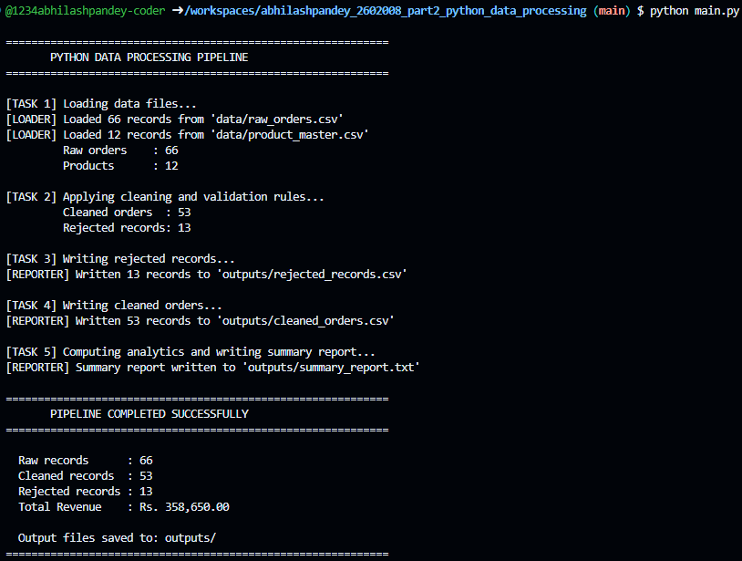
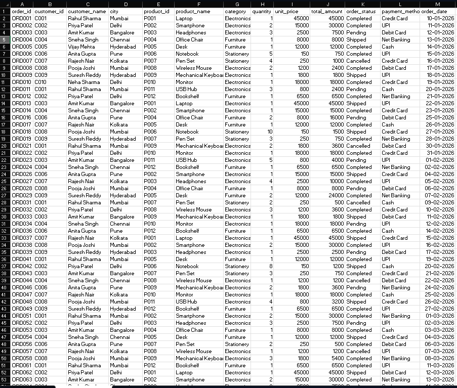
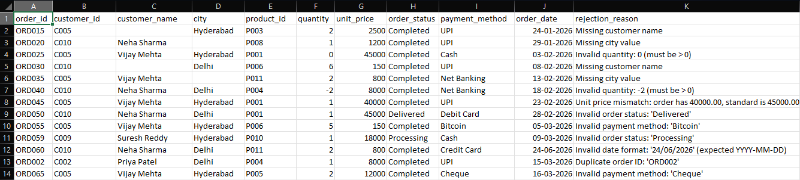
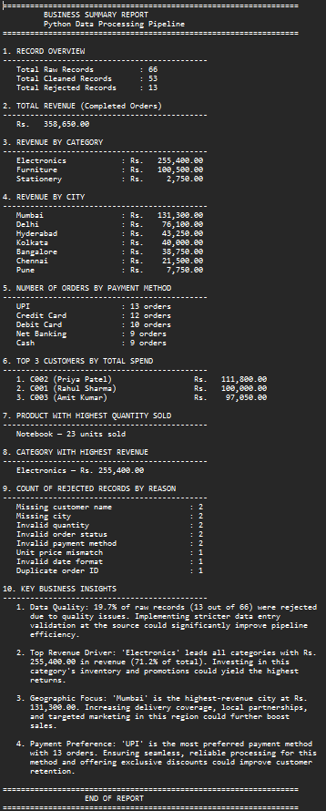

# Capstone Project Part 2 - Python Data Processing
## Assignment Title
**Part 2: Python Data Processing Without Pandas**

## Student Information
- **Student Name:** Abhilash Pandey
- **Student ID:** rotman_ddm_2602008


---

## Dataset Description

### raw_orders.csv (66 rows)
A business order dataset containing customer orders across multiple cities in India. The dataset was created manually and **intentionally includes 12+ data quality issues** to test the pipeline's cleaning and validation logic.

| Column         | Description                          |
|----------------|--------------------------------------|
| order_id       | Unique identifier for each order     |
| customer_id    | Customer reference ID                |
| customer_name  | Full name of the customer            |
| city           | City where the order was placed      |
| product_id     | Product reference ID                 |
| quantity       | Number of units ordered              |
| unit_price     | Price per unit (in Rs.)              |
| order_status   | Status: Completed/Pending/Shipped/Cancelled |
| payment_method | Payment: Credit Card/Debit Card/UPI/Cash/Net Banking |
| order_date     | Date of order in YYYY-MM-DD format   |

### product_master.csv (12 rows)
Master reference for all available products.

| Column         | Description              |
|----------------|--------------------------|
| product_id     | Unique product ID        |
| product_name   | Name of the product      |
| category       | Product category         |
| standard_price | Official price (Rs.)     |

---

## Intentionally Added Data Quality Issues

The raw dataset includes the following 12 data quality issues (documented for grading):

| # | Issue Type                        | Row(s) Affected          |
|---|-----------------------------------|--------------------------|
| 1 | **Duplicate order IDs**           | ORD002 (appears at row 2 and row 65) |
| 2 | **Missing customer names**        | ORD015, ORD030           |
| 3 | **Missing city values**           | ORD020, ORD035           |
| 4 | **Inconsistent city spellings**   | ORD062 (DELHI), ORD063 (bangalore) |
| 5 | **Extra spaces**                  | ORD061 ("  Rahul   Sharma  ", "  Mumbai  ") |
| 6 | **Incorrect casing**              | ORD062 (priya patel), ORD064 (SNEHA SINGH) |
| 7 | **Quantity as 0**                 | ORD025 (quantity=0)      |
| 8 | **Negative quantity**             | ORD040 (quantity=-2)     |
| 9 | **Unit price mismatch**           | ORD045 (Laptop at 40000 vs standard 45000) |
| 10 | **Invalid order status**         | ORD050 (Delivered), ORD059 (Processing) |
| 11 | **Invalid payment method**       | ORD055 (Bitcoin), ORD065 (Cheque) |
| 12 | **Invalid date format**          | ORD060 (24/06/2026 instead of YYYY-MM-DD) |

---

## Cleaning Rules Applied

The following cleaning operations are applied in `src/cleaner.py`:

- **Trim extra spaces:** `" ".join(value.split())` removes leading, trailing, and internal extra spaces from all string fields
- **Standardize customer names:** Title Case applied (e.g., `priya patel` → `Priya Patel`)
- **Standardize city names:** Title Case applied (e.g., `DELHI` → `Delhi`, `bangalore` → `Bangalore`)
- **Standardize order status:** Mapped to canonical values (e.g., `Canceled` → `Cancelled`)
- **Standardize payment method:** Mapped to canonical values (e.g., `Upi` → `UPI`)
- **Recalculate total_amount:** Always recalculated as `quantity × unit_price`
- **Enrich with product data:** `product_name` and `category` are looked up from `product_master.csv`

---

## Rejection Rules Applied

Records are rejected (saved to `rejected_records.csv` with reason) when:

| Rejection Reason             | Condition                                                  |
|------------------------------|------------------------------------------------------------|
| Duplicate order ID           | `order_id` already seen in a previous row                 |
| Missing customer name        | `customer_name` is empty after trimming                   |
| Missing city value           | `city` is empty after trimming                            |
| Product ID not found         | `product_id` not present in `product_master.csv`          |
| Invalid quantity             | `quantity` ≤ 0 or cannot be parsed as a number            |
| Unit price mismatch          | `unit_price` differs from `standard_price` by > Rs. 0.50 |
| Invalid order status         | Not one of: Completed, Pending, Shipped, Cancelled        |
| Invalid payment method       | Not one of: Credit Card, Debit Card, UPI, Cash, Net Banking |
| Invalid date format          | `order_date` is not in `YYYY-MM-DD` format                |

Records with **multiple issues** are rejected once, with **all reasons** recorded (semicolon-separated).

---

## File Structure Explanation

```
studentname_studentid_part2_python_data_processing/
├── README.md               ← This file
├── main.py                 ← Pipeline entry point; calls all src/ functions
├── src/
│   ├── __init__.py         ← Makes src a Python package
│   ├── loader.py           ← Loads CSV files into lists and dicts
│   ├── cleaner.py          ← Cleans, validates, and classifies records
│   ├── analyzer.py         ← Computes revenue, rankings, and insights
│   └── reporter.py         ← Writes all output files
├── data/
│   ├── raw_orders.csv      ← Input: 66 raw orders (with intentional issues)
│   └── product_master.csv  ← Input: 12 product reference records
├── outputs/
│   ├── cleaned_orders.csv  ← Valid records after cleaning (53 rows)
│   ├── rejected_records.csv← Invalid records with rejection reasons (13 rows)
│   ├── summary_report.txt  ← Business analytics summary
│   └── screenshots/        ← Screenshots of pipeline output
└── tests/
    └── test_cases.md       ← 14 test cases covering all validation scenarios
```

---

## How to Run the Project

### Prerequisites
- Python 3.7 or higher
- No external libraries required (only Python standard library)

### Steps

1. **Clone the repository:**
   ```bash
   git clone https://github.com/1234abhilashpandey-coder/abhilashpandey_2602008_part2_python_data_processing.git
   cd abhilashpandey_2602008_part2_python_data_processing
   ```

2. **Run the pipeline:**
   ```bash
   python main.py
   ```

3. **View the outputs:**
   ```
   outputs/cleaned_orders.csv    — Cleaned valid records
   outputs/rejected_records.csv  — Rejected records with reasons
   outputs/summary_report.txt    — Business summary report
   ```

---

## Generated Output Files

| File                         | Description                                                   |
|------------------------------|---------------------------------------------------------------|
| `outputs/cleaned_orders.csv` | 53 valid records enriched with product_name, category, and recalculated total_amount |
| `outputs/rejected_records.csv` | 13 rejected records with full original values + rejection_reason column |
| `outputs/summary_report.txt` | Contains revenue totals, city/category breakdown, top customers, and 4 business insights |

---

## Screenshots

### 1. Pipeline Execution


### 2. Cleaned Orders


### 3. Rejected Records


### 4. Summary Report


---

## Key Business Insights

1. **Data Quality:** 19.7% of raw records (13 out of 66) were rejected due to data quality issues. Stricter validation at data entry could reduce losses.

2. **Top Revenue Category:** Electronics leads with Rs. 2,55,400 — 71.2% of total revenue. Prioritising Electronics inventory and promotions would yield the highest returns.

3. **Top City:** Mumbai generates the highest revenue at Rs. 1,31,300. Increasing delivery coverage and local marketing in Mumbai could further boost sales.

4. **Payment Preference:** UPI is the most used payment method (13 orders). Ensuring smooth UPI processing and offering UPI-exclusive offers could drive higher customer satisfaction.

---

## Assumptions Made

1. The `unit_price` in raw orders must match `standard_price` in the product master within a Rs. 0.50 tolerance (to allow for minor floating-point differences). Any deviation greater than this is treated as a mismatch and rejected.
2. Only the **first occurrence** of a duplicate `order_id` is considered valid; all subsequent occurrences are rejected.
3. `total_amount` is always **recalculated** as `quantity × unit_price` and not trusted from the raw input.
4. Casing and spacing issues in `customer_name`, `city`, `order_status`, and `payment_method` are treated as **cleanable** (not rejectable) errors.
5. The valid date format is strictly `YYYY-MM-DD`. Any other format (e.g., DD/MM/YYYY, MM-DD-YYYY) is rejected.
6. All revenue calculations use only **Completed** orders.
